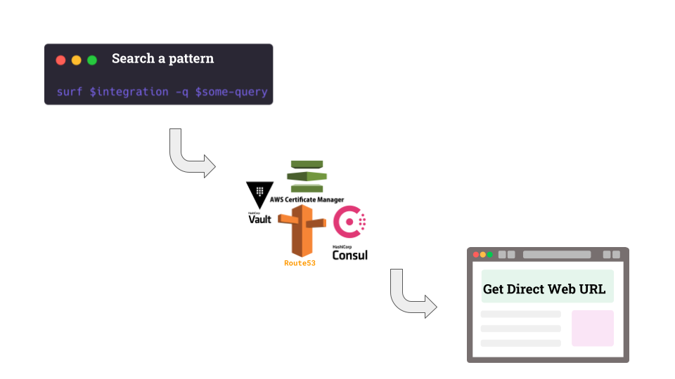

# SURF

Free Text Search across your infrastructure platforms via CLI.

It's like `... | grep` but for your entire infrastructure!

S.U.R.F is an acronym for: `Search-Unified-Recursive-Fast` 


# Supported Platforms

- [X] [AWS Route53 and Targets](https://github.com/Isan-Rivkin/route53-cli)
- [X] [AWS CloudControl](https://aws.amazon.com/cloudcontrolapi/)
- [X] [AWS ACM](https://aws.amazon.com/certificate-manager/)
- [X] [AWS S3](https://aws.amazon.com/s3/)
- [X] [AWS DynamoDB](https://aws.amazon.com/dynamodb/)
- [x] [Hashicorp Vault](https://www.vaultproject.io/)
- [X] [Hashicorp Consul KV](https://www.consul.io/docs/dynamic-app-config/kv)
- [X] [ElasticSearch / AWS OpenSearch](https://aws.amazon.com/opensearch-service/the-elk-stack/what-is-opensearch/)
- [X] [Logz.io](https://logz.io/)
- [ ] Kubernetes - TODO  

# Table of Contents 

- [SURF](#surf)
- [Supported Platforms](#supported-platforms)
- [Table of Contents](#table-of-contents)
- [Overview](#overview)
- [Usage Examples](#usage-examples)
  - [AWS Route53 Usage](#aws-route53-usage)
  - [AWS Cloud Control Usage](#aws-cloud-control-usage)
  - [AWS ACM Usage](#aws-acm-usage)
  - [AWS DynamoDB Usage](#aws-dynamodb-usage)
  - [AWS S3 Usage](#aws-s3-usage)
  - [Hashicorp Vault Usage](#hashicorp-vault-usage)
  - [Hashicorp Consul Usage](#hashicorp-consul-usage)
  - [ElasticSearch and OpenSearch Usage](#elasticsearch-and-opensearch-usage)
  - [Logz.io Usage](#logzio-usage)
- [Install](#install)
    - [Brew](#brew)
    - [Download Binary](#download-binary)
    - [Install from Source](#install-from-source)
- [Authentication](#authentication)
  - [Supported Authentication Methods](#supported-authentication-methods)
- [Version check](#version-check)
- [How it Works](#how-it-works)
- [Contributors](#contributors)

# Overview

SURF is built for Infrastructure Engineers as a CLI tool that enables searching any pattern across different platforms. 
Usually, the results are returned with a direct web URL. 

The search process depends on the context, for example: if you're searching in Vault it'll pattern match against keys. Instead, if you're searching in Route53 AWS a DNS address it'll return links to the targets behind it (e.g Load balancer). 


# Usage Examples 

## AWS Route53 Usage 

Based on [AWS Route53](https://github.com/Isan-Rivkin/route53-cli): Search what's behind domain `api.my-corp.com`: 

```bash 
surf r53 -q api.my-corp.com
```

## AWS Cloud Control Usage 

Cloud Control API allows searching across AWS resources in a resource agnostic manner. 
All resource types has CRUD and based on REST so we can list, get, create, delete.

The Supported resource types are auto generated into the code during every build see [cloudformation_resources.gen.go](./lib/awsu/cloudformationgenerated/cloudformation_resources.gen.go).

**List Supported resource types**

```bash
surf aws types
```


## AWS ACM Usage 

Search inside ACM Certificates in AWS.

Example search: containing a domain: 

```bash
surf acm -q my-domain.com
```

Example search: certificate attached to a loab balancer: 

```bash
surf acm -q 's:elasticloadbalancing:us-west-2:123:loadbalancer/app/alb' --filter-used-by
```

## AWS DynamoDB Usage 

Search free text data in DynamoDB 

**Supported Formats:** `protobuf`, `base64`, `json`, `binary`, `bytes`.


Example: list existing tables

```bash 
surf ddb --list-tables
```
	
Example: use `-p` for aws profile, `-r` for region

```bash 
surf ddb -q val -t table -p my-aws-profile -r us-east-1
```

Example: search all tables with `production` in their name, where the data containing the pattern `val`

```bash 
surf ddb -q val --all-tables -t production
```

Example: search all tables data containing the word `val`, output as `JSON`

```bash 
surf ddb -q val --all-tables -o json
```

Example: `stop on first match`, search all tables data containing the word `val`

```bash 
surf ddb -q val -t my-prefix-table --stop-first-match
```


## AWS S3 Usage 

Search inside S3 Buckets and Keys in AWS. 

Example: Find all keys containing `logs` in all buckets containing the name `prod-bucket`:

```bash 
surf s3  -q 'logs' -b 'prod-bucket'
```

Example: find all keys containng `house` with prefix key `my`

```
surf s3 --prefix my -q house -b my-bucket
```

Example: find all keys ending with `.json` and use non-default AWS profile:

```
surf s3 -q '\.json$' -b bucket-prefix -p my-aws-profile 
```

Optional: Configure a default bucket name (same as `--bucket` flag) to start search from (any regex pattern): 

```bash
export SURF_S3_DEFAULT_MOUNT=<my-bucket-pattern>
```

## Hashicorp Vault Usage 

Search the query `aws` in Vault: 

```bash
surf vault -q aws 
```

Configure a default mount to start search from in Vault: 

```bash
export SURF_VAULT_DEFAULT_MOUNT=<my-default-mount>
```

Store LDAP auth on your OS keychain: 

```bash
surf config
```

## Hashicorp Consul Usage

Search all keys containing the substring `server` 

```bash
surf consul -q "server"
```

Search under the `scripts` path for keys ending with `.sh`

```bash
surf consul --prefix scripts --query "\.sh$"
```

## ElasticSearch and OpenSearch Usage 

Search free text and/or [KQL](https://www.elastic.co/guide/en/kibana/master/kuery-query.html). 

Supports Standard Elasticsearch and AWS Opensearch. 

- Example: Search docs containing the term `api` return limit 40 results.

  ```bash
  surf es -q 'api' -l 40
  ```

- Example: Search in indexes `prod-*` and `api-*`

  ```bash
  surf es -q 'api' -i 'prod-*d' -i 'api-*'
  ```

- Example: Search docs containing the term `api` with client field and `xyz*` pattern and NOT containing the term `staging`
	
  ```bash
  surf es -q 'api AND client:xyz*' --nq staging
  ```

- Example: List Indexes 

  ```bash
  surf es --list-indexes
  ```

- Example: Configure Elasticsearch default settings (use `surf es --help` for more):

  ```bash
  SURF_ELASTICSEARCH_URL
  SURF_ELASTICSEARCH_USERNAME='token-or-username-and-password'
  SURF_ELASTICSEARCH_PASSWORD='token-or-username-and-password'
  SURF_ELASTICSEARCH_TOKEN='token-or-username-and-password'
  SURF_ELASTICSEARCH_INDEXES='prod-*,api-*'
  ```

- Example: Store Username/Password or Token auth on your OS keychain:

  ```bash
  surf config
  ```

## Logz.io Usage 

Free text and [KQL](https://www.elastic.co/guide/en/kibana/master/kuery-query.html) Search in [logz.io](https://logz.io/), use the [api website](https://docs.logz.io/user-guide/accounts/account-region.html) to get the address.

- Example: Search docs containing the word 'exception' with limit size 200 

  ```bash
  surf logz -q 'exception' -l 200
  ```

- Example: Search docs containing the word 'something' across ALL sub-accounts matching production/automation

  ```bash
  surf logz -q 'something' --acc production --acc automation 
  ```

- Example: Search docs containing the word 'production', field errorCode with value Access* and are not containing 'dummy' 

  ```bash
  surf logz -q 'production AND errorCode:Access*' --nq 'dummy'
  ```

- Example: Search docs across 10 day window with 2 days offset (e.g all matches between 12 days ago until 2 days ago)

  ```bash
  surf logz -o 2 -w 10d -q 'some pattern'
  ```


- Example: Configure Logz.io default settings (use `surf logz --help` for more):

  ```bash
  SURF_LOGZ_IO_TOKEN
  SURF_LOGZ_IO_URL
  SURF_LOGZ_IO_ACCOUNT_IDS
  ```

- Example: Store Username/Password or Token auth on your OS keychain:

  ```bash
  surf config
  ```

# Install 

### Brew 

MacOS (and ubuntu supported) installation via Brew:

```bash
brew tap isan-rivkin/toolbox
brew install surf
```

### Download Binary

1. [from releases](https://github.com/Isan-Rivkin/surf/releases)

2. Move the binary to global dir and change name to `surf`:

```bash
cd <downloaded zip dir>
mv surf /usr/local/bin
```

### Install from Source

```bash
git clone git@github.com:Isan-Rivkin/surf.git
cd surf
go run main.go
```

# Authentication

*Please open a PR and request additional methods if you need.*

## Supported Authentication Methods 

- [x] Vault - LDAP (run `$surf config` )
- [x] AWS - via profile on `~/.aws/credentials file`
- [x] Consul - None
- [X] Elasticsearch / Opensearch - User/Pass or Token (run `$surf config` or `surf es --help`)
- [X] Logz.io - Token (run `$surf config` or `surf logz --help`)


# Version check 

The CLI will query [github.com](https://github.com/Isan-Rivkin/surf/releases) to check if there is a newer version and print out a message to the terminal.

If you wish to opt out set the environment variable `SURF_VERSION_CHECK=false`. 

No Data is collected it is purely [github.com](https://github.com/Isan-Rivkin/surf/releases) query.


# How it Works 



# Contributors 

* @AliRamberg  
* @Isan-Rivkin